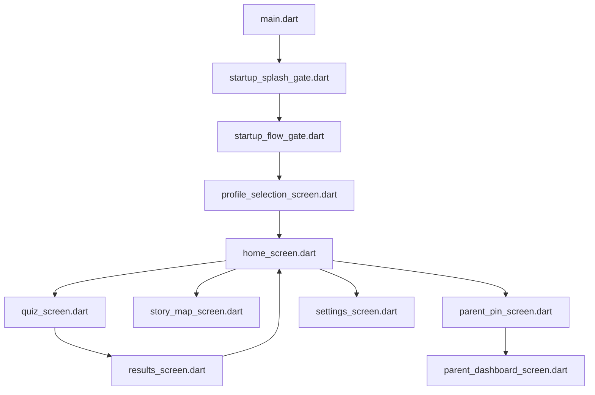
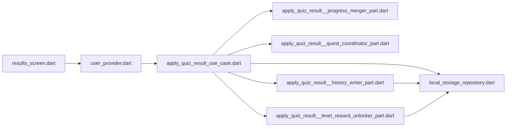

<!--
typ: reference
syfte: Snabb spårkarta mellan skärm, provider, service och lagring
uppdaterad: 2026-05-29
-->

# Trace Map

Detta dokument ar till for snabb orientering. Las `ARCHITECTURE.md` for full facitbild och `../lib/START_HERE.md` for kodnara ingangar.

## Namnsignaler

- `*_screen.dart`: entrypoint for en skarm
- `*_provider.dart`: state eller wiring runt skarmen
- `*_service.dart`: regler eller tekniska integrationer
- `__*_part.dart`: intern del till filen bredvid, inte en egen modul

## Huvudflode i appen

## Quizresultat till permanent data

## Var ska jag borja

| Jag vill andra | Borja i | Las sedan | Data landar har |
| --- | --- | --- | --- |
| Home-CTA, hero och resume-logik | `lib/features/home/presentation/screens/home_screen.dart` | `lib/features/home/providers/home_read_model_provider.dart`, `lib/features/home/presentation/home_read_model.dart` | Ingen direkt skrivning |
| Hur en fraga byggs | `lib/core/providers/quiz_provider.dart` | `lib/core/services/quiz_session_planner.dart`, `lib/core/services/question_generator_service.dart`, `lib/core/services/question_mix_policy.dart` | Pagaende session i `quiz_history` |
| Vad som hander nar quiz slutar | `lib/features/quiz/presentation/screens/results_screen.dart` | `lib/core/providers/user_provider.dart`, `lib/core/services/apply_quiz_result_use_case.dart` | `user_progress` och complete `quiz_history` |
| Storykartan och nasta stopp | `lib/features/story/presentation/screens/story_map_screen.dart` | `lib/core/providers/story_progress_provider.dart`, `lib/core/services/story_progression_service.dart`, `lib/core/services/quest_progression_service.dart` | Read-only fran user- och settingsdata |
| Parent PIN och toggles | `lib/features/parent/presentation/screens/parent_pin_screen.dart` | `lib/features/parent/presentation/screens/parent_dashboard_screen.dart`, `lib/domain/services/parent_pin_service.dart`, `lib/core/providers/parent_settings_provider.dart` | `settings` |
| Daily challenge och streak | `lib/features/daily_challenge/presentation/widgets/daily_challenge_card.dart` | `lib/features/daily_challenge/providers/daily_challenge_provider.dart`, `lib/core/services/daily_challenge_service.dart` | `settings` |

## Nasta steg om du vill grava djupare

- `README.md` for docindex
- `SERVICES_API.md` for servicekontrakt
- `PROJECT_STRUCTURE.md` for verklig mappstruktur